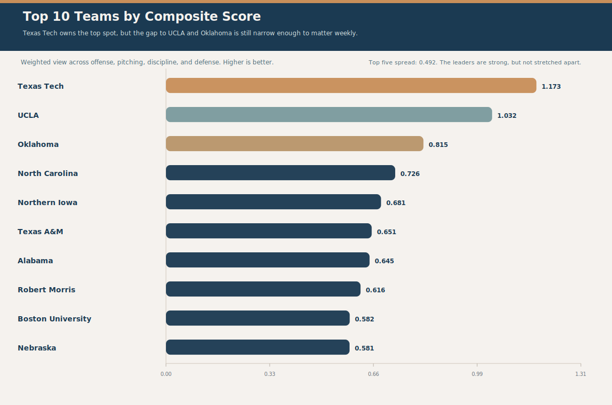
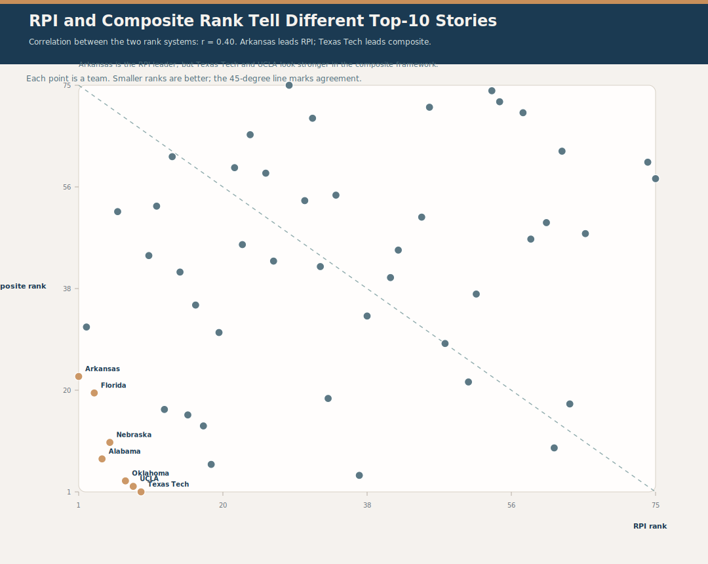
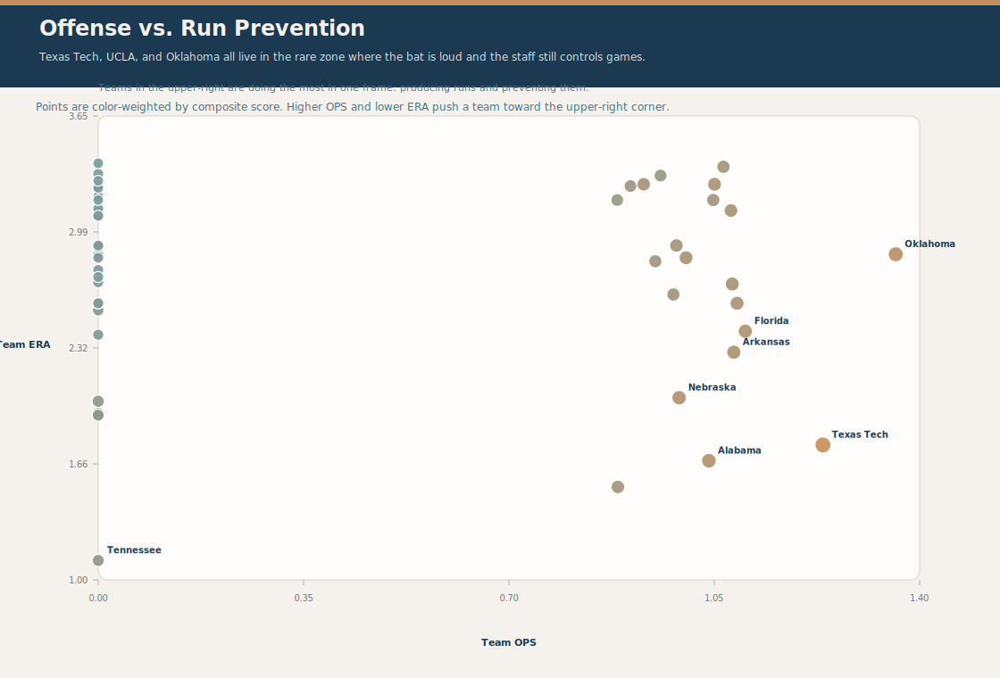
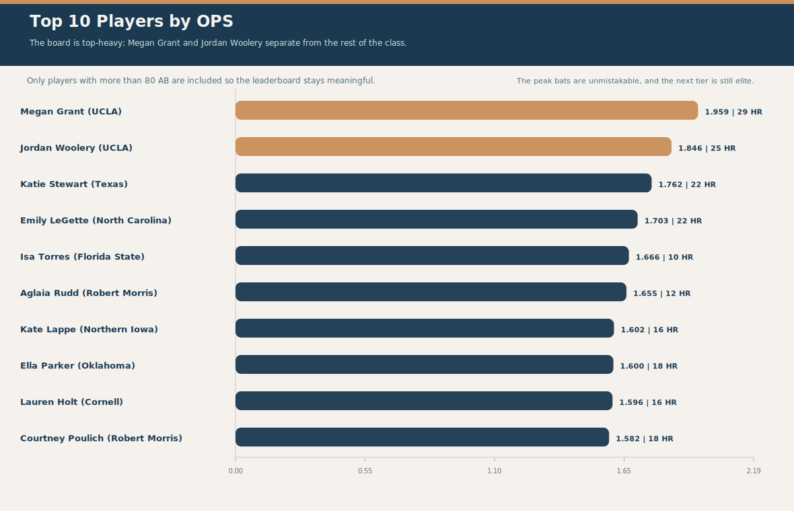
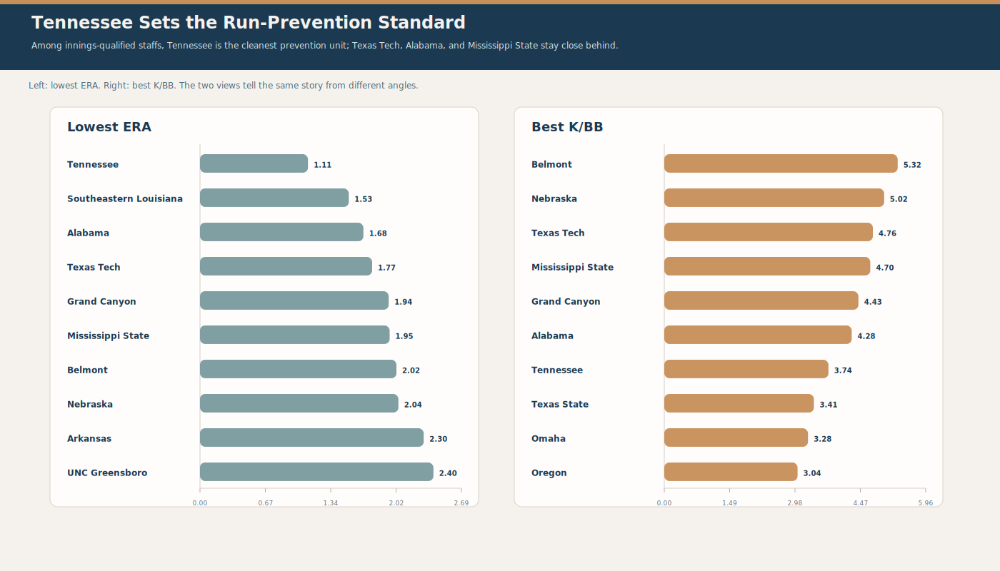

# D1 Softball Manual Workbook Report

April 2026 manual workbook import, translated into a publishable markdown brief.

> This report follows the notebook's editorial structure, but swaps in cleaner team-level angles for findings 02 and 07.

## At a Glance

| Metric | Value |
| --- | ---: |
| Team rows | 79 |
| Player rows | 125 |
| Batting players with AB > 0 | 100 |
| Pitching players with IP > 0 | 26 |
| Teams with innings-qualified pitching | 50 |
| Composite vs. RPI correlation | 0.40 |

## Dataset & Method

The workbook arrives as five tabs: team batting, team pitching, player batting, player pitching, and RPI. The player batting and player pitching tabs do **not** need to overlap; they are treated as separate source slices and summarized on their own terms.

For the report, I:

- merged the team tabs into a single team snapshot with batting, pitching, and composite fields
- kept batting and pitching player tables separate, because the workbook only partially overlaps them
- used the RPI tab as schedule-strength context
- filtered pitching leaderboards to innings-qualified staffs so the prevention story stays credible

## Executive Summary

The imported workbook makes one thing clear immediately: the top end is crowded, but not random. Texas Tech owns the composite crown, UCLA and Oklahoma stay right on its heels, and the RPI table tells a different story with Arkansas at No. 1. At the player level, Megan Grant is the loudest bat in the file, while Tennessee's staff gives the cleanest prevention profile among innings-qualified teams.

### Key Scoreboard

| Team | Composite | OPS | ERA | RPI |
| --- | ---: | ---: | ---: | ---: |
| Texas Tech | 1.173 | 1.236 | 1.77 | 9.000 |
| UCLA | 1.032 | 1.311 | n/a | 8.000 |
| Oklahoma | 0.815 | 1.360 | 2.86 | 7.000 |
| North Carolina | 0.726 | 1.092 | n/a | 37.000 |
| Northern Iowa | 0.681 | 1.085 | n/a | n/a |

### Story Arc

- **Hook** - Top-5 race is primed for fan-facing weekly drama: Start with the story fans feel first: the board is tight enough that weekly movement matters.
- **Evidence** - Texas Tech leads the all-around team profile: Show why Texas Tech sits at the top of the all-around leaderboard.
- **Contrast** - Arkansas owns the RPI crown, but Texas Tech owns the composite crown: Introduce the main contradiction: RPI crowns one team, the composite crowns another.
- **Action** - Megan Grant leads the long-ball race: Move from team shape to star power with the loudest bat in the workbook.
- **Implication** - Texas Tech profiles as a coaching-efficiency standout: Translate the bat into a broader coaching and execution signal.
- **Support** - Tennessee owns the strongest run-prevention staff: Bring in the run-prevention staff that most clearly controls the game.
- **Support** - Nebraska shows one of the cleanest balanced profiles: Add the balance note that explains why some teams hold their shape.
- **Close** - The offensive leaderboard is top-heavy, but not singular: Close with the offensive tier that sets the ceiling for the whole board.

## Figures

### Figure 1

*Texas Tech leads the composite board, with UCLA and Oklahoma close enough to keep the top tier live.*

### Figure 2

*RPI and the composite model only partially agree, which is why Arkansas and Texas Tech split the top-line story.*

### Figure 3

*The best teams pair a real offense with enough run prevention to keep the run differential alive.*

### Figure 4

*Megan Grant and Jordan Woolery anchor the player leaderboard, with Katie Stewart and Emily LeGette in the next cluster.*

### Figure 5

*Tennessee owns the cleanest prevention profile, while Texas Tech and Alabama stay close enough to matter.*

## Findings

### 01. Texas Tech leads the all-around team profile

**Takeaway:** Texas Tech ranks first by composite score, signaling balanced strength across offense, pitching, discipline, and defense.

**Evidence:**
- `team`: `Texas Tech`
- `composite_score`: `1.1728`
- `composite_rank`: `1`

**Visuals:**
- Top-10 composite bar chart
- Team-signal map

### 02. Arkansas owns the RPI crown, but Texas Tech owns the composite crown

**Takeaway:** RPI and the composite model are only moderately aligned here, with correlation at 0.40; Arkansas is No. 1 in RPI, but Texas Tech is No. 1 in composite.

**Evidence:**
- `arkansas_rpi_rank`: `1`
- `arkansas_composite_rank`: `22`
- `texas_tech_rpi_rank`: `9`
- `texas_tech_composite_rank`: `1`
- `rank_correlation`: `0.3988`

**Visuals:**
- RPI vs composite scatter
- Rank-difference highlight table

### 03. Texas Tech profiles as a coaching-efficiency standout

**Takeaway:** Texas Tech combines elite discipline with strong run-prevention markers, a profile that usually signals repeatable coaching value rather than one-off luck.

**Evidence:**
- `discipline_z`: `2.473`
- `pitching_z`: `0.7245`
- `k_bb_ratio`: `4.7576`
- `whip`: `0.8776`

**Visuals:**
- Offense vs. pitching scatter
- Texas Tech callout card

### 04. Top-5 race is primed for fan-facing weekly drama

**Takeaway:** The top five teams sit within 0.492 composite points, which is tight enough for weekly movement to matter.

**Evidence:**
- `top5_teams`: `Texas Tech, UCLA, Oklahoma, North Carolina, Northern Iowa`
- `top1_score`: `1.1728`
- `top5_score`: `0.6808`
- `gap`: `0.492`

**Visuals:**
- Top-10 composite bars
- Top-5 gap callout

### 05. Nebraska shows one of the cleanest balanced profiles

**Takeaway:** Among innings-qualified teams, Nebraska keeps offense and pitching relatively close together, which usually travels better than a one-sided profile.

**Evidence:**
- `offense_z`: `0.7758`
- `pitching_z`: `0.6201`
- `balance_gap`: `0.1557`

**Visuals:**
- Offense vs. pitching scatter
- Balance-gap mini table

### 06. Megan Grant leads the long-ball race

**Takeaway:** Megan Grant is the loudest individual bat in the workbook, pairing a huge OPS with a home run total that sits far above the next tier.

**Evidence:**
- `team`: `UCLA`
- `ops`: `1.9587`
- `hr`: `29`
- `ab`: `108`

**Visuals:**
- Top player OPS bars
- Home-run leaderboard

### 07. Tennessee owns the strongest run-prevention staff

**Takeaway:** Among innings-qualified staffs, Tennessee sits at the top of both ERA and WHIP, which gives it the cleanest prevention profile in the workbook.

**Evidence:**
- `era`: `1.11`
- `whip`: `0.7642`
- `k_bb_ratio`: `3.7444`
- `ip`: `276.1`

**Visuals:**
- Pitching-staff leaderboard
- Prevention profile card

### 08. The offensive leaderboard is top-heavy, but not singular

**Takeaway:** Oklahoma, UCLA, Texas Tech, and Florida form the clearest offensive tier; the next few schools are good, but the gap to the top four is real.

**Evidence:**
- `top_4`: `Oklahoma, UCLA, Texas Tech, Florida`
- `top_4_ops`: `1.360, 1.311, 1.236, 1.103`

**Visuals:**
- Top-10 team OPS chart
- Offense-vs-pitching map

## Deeper Analysis Queue

### Which teams overperform expected results once schedule strength is introduced?

- **Why it matters:** Separates true strength from context effects and improves ranking stability.
- **Needed data:** team-level game logs, opponent quality, home/away
- **Method:** Schedule-adjusted residual modeling
- **Priority:** high

### Which player profiles are most predictive of postseason run production?

- **Why it matters:** Identifies transferable offensive traits under stronger pitching.
- **Needed data:** player splits, high-leverage situations, postseason samples
- **Method:** Feature importance with holdout seasons
- **Priority:** high

### Where does pitching usage create hidden fatigue or efficiency edges?

- **Why it matters:** Supports coaching decisions on rotation, bullpen leverage, and recovery windows.
- **Needed data:** pitching appearances, days rest, opponent strength
- **Method:** Usage clustering + rolling trend decomposition
- **Priority:** medium

### Which fan-facing storylines have the highest week-to-week volatility?

- **Why it matters:** Improves content planning around credible, high-interest swings.
- **Needed data:** weekly rankings, individual performance deltas, team outcomes
- **Method:** Volatility index + change-point detection
- **Priority:** medium

## Data Notes

- The workbook is partial by design: batting and pitching rows are not fully overlapped, so player-level analysis is better treated as two complementary slices rather than a single joined table.
- Team-level claims are strongest where both batting and pitching coverage exist, especially among the innings-qualified staffs used in the prevention charts.
- The report uses the workbook as a snapshot, not a season-complete game-log feed.

## Source Artifacts

- EDA run: `/Users/krystalbeasley/Documents/Softball 2026/eda_runs/2026-04-16T074017Z`
- Report files: `/Users/krystalbeasley/Documents/Softball 2026/reports/d1softball_manual_april2026`
